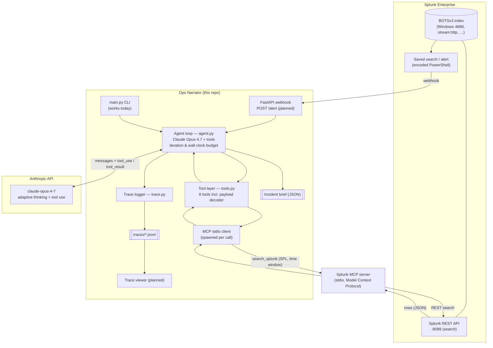
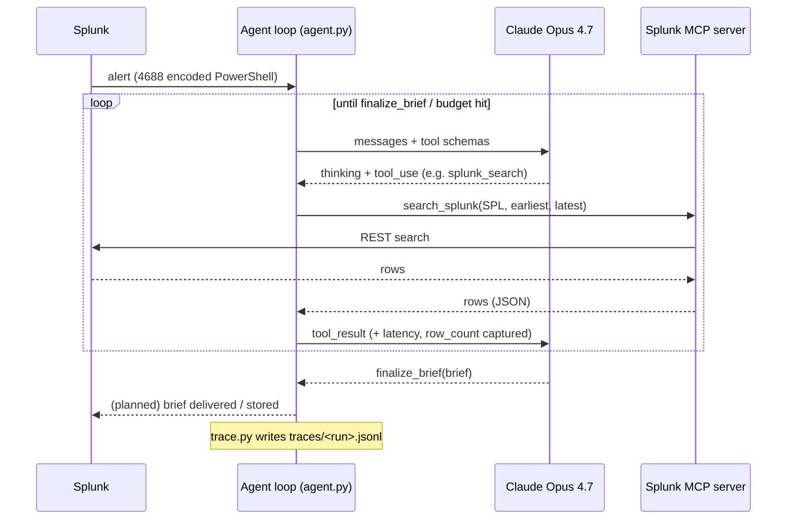

# Ops Narrator — Architecture

Ops Narrator turns a single Splunk alert into a finished incident investigation. A Splunk
saved search fires a webhook; an Anthropic Claude agent loop investigates by running its own
Splunk queries through the **Splunk MCP server**; it emits an incident brief and a JSONL
reasoning trace.

## System diagram

## Investigation sequence (one run)

## How the three required pieces connect

**1. How the application interacts with Splunk.**
Splunk is both the *trigger* and the *evidence store*. A saved search detects the suspicious
event and POSTs it to the webhook (`/alert`; the `main.py` CLI provides the same entrypoint
today). During the investigation, every Splunk‑backed tool in `tools.py` talks to Splunk
**through the Splunk MCP server over stdio** — the MCP server issues the actual REST search
against Splunk's management API (`:8089`) and returns rows. The app never embeds answers; it
queries live Splunk data. Connection settings (host/port/scheme, username/password) are passed
to the MCP subprocess via its environment.

**2. How AI models / agents are integrated.**
The agent is a manual tool‑use loop (`agent.py`) over `claude-opus-4-7` with adaptive extended
thinking. Claude is given the alert plus eight tool schemas and chooses each next action; the
loop executes the tool, feeds the result back, and repeats under a hard iteration and
wall‑clock budget until Claude calls `finalize_brief`. The model‑facing prompt and tool
descriptions are intentionally generic (no dataset/threat/host/outcome names) so the agent
reasons from evidence rather than recall.

**3. Data flow between services, APIs, and components.**
`Splunk saved search → webhook/CLI → agent loop ⇄ Anthropic API` for reasoning, and
`agent loop → tools → MCP stdio client → Splunk MCP server → Splunk REST → rows back up the
same path`. Two artifacts fall out of every run: the **incident brief** (structured JSON from
`finalize_brief`) and a **JSONL reasoning trace** written by `trace.py` (one event per thinking
step, tool call with latency + row count, tool result, and detected hypothesis revision),
which the planned single‑page viewer renders.
